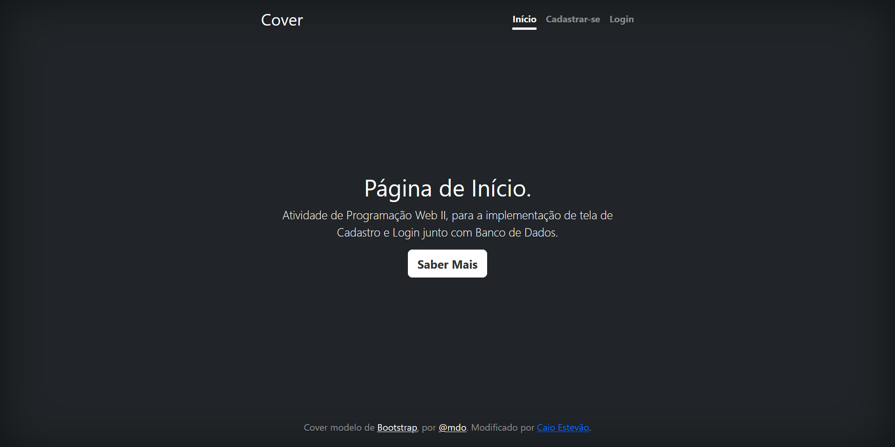
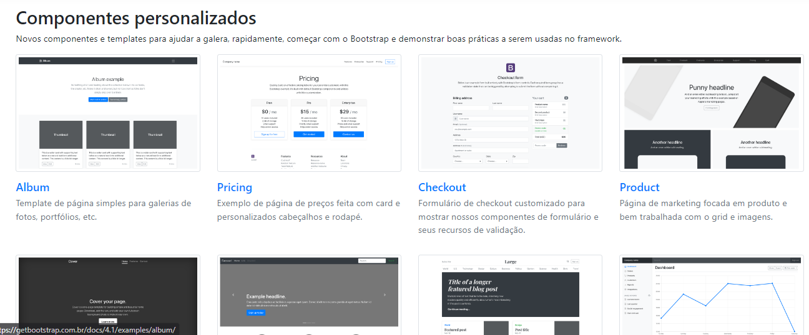
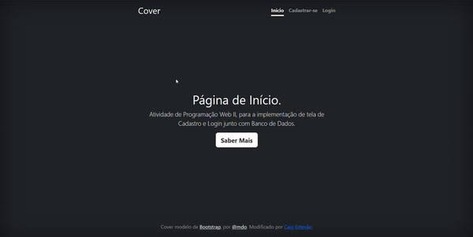

<!--# Índice 

* [Projeto de Portfólio Pessoal](#projeto-de-portifolio-pessoal)  
* [Descrição](#descri%C3%A7%C3%A3o)  
* [Introdução](#introdu%C3%A7%C3%A3o)  
* [Funcionalidades](#funcioanlidades)  
* [Tecnologia Utilizadas](#tecnologia-utilizadas)  
* [Fontes Consultadas](#fontes-consultadas)  
* [Autores](#autores)  -->

# Projeto de Cadastro e Login
Projeto criado utilizando exemplo do Bootstrap para aprendizagem e futuro uso de Banco de Dados.

## Descrição
Neste projeto utilizamos o Bootstrap e foi feito mudanças, como a implementação de telas de cadastro e login. 
Foi usado um modelo de site já pronto de bootstrap.

## Introdução
O Projeto serve para melhorar as competências com banco de dados e para ajudar no processo do Projeto Integrador(TCC).

## Funcionalidades
O projeto contém mais de uma página, no qual temos a tela de cadastro, que contém confirmação dos campos e redirecionamento da página, e também o login. Futura implementação com o Banco de Dados.

## Tecnologia Utilizadas
- :heavy_check_mark: [HTML]
- :heavy_check_mark: [CSS]
- :heavy_check_mark: [PHP]
- :heavy_check_mark: [BOOTSTRAP]
- :heavy_check_mark: [GIT]

## Autores
Aluno: Caio Estevão
- Github: [github.com](https://github.com/Caioestevao1000)