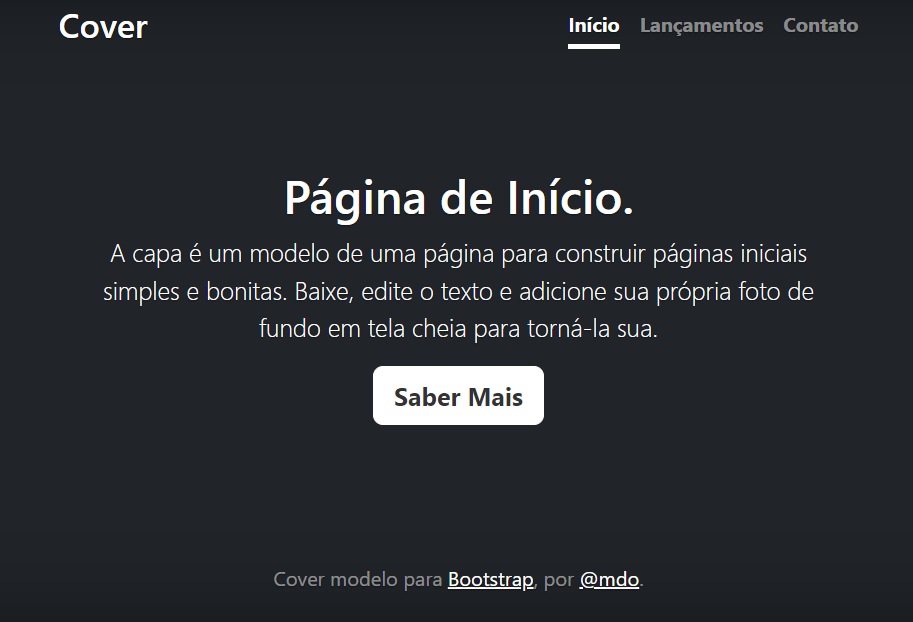

# Índice 

* [Projeto de Portfólio Pessoal](#projeto-de-portifolio-pessoal)  
* [Descrição](#descri%C3%A7%C3%A3o)  
* [Introdução](#introdu%C3%A7%C3%A3o)  
* [Funcionalidades](#funcioanlidades)  
* [Tecnologia Utilizadas](#tecnologia-utilizadas)  
* [Fontes Consultadas](#fontes-consultadas)  
* [Autores](#autores)  

# Projeto De Portifólio Pessoal

Projeto criado utilizando exemplo do Bootstrap para ensino do README e do Bootstrap.

## Descrição
Neste projeto utilizamos o Bootstrap e melhoramos na construção do README. 
Foi usado um modelo de site já pronto do bootstrap.

## Introdução
O Projeto do Portifólio Pessoal serve para melhorar as competências em manipulação do BOOTSTRAP e a escrita do README.

## Funcioanlidades
O código serve para demonstração um modelo de bootstrap, com algumas opçõe de acesso: Início, Lançamentos, Contatos e Saber Mais. Modo escuro estará disponível em uma atualização futura.

## Tecnologia Utilizadas
- :heavy_check_mark: [HTML]
- :heavy_check_mark: [CSS]
- :heavy_check_mark: [BOOTSTRAP]
- :heavy_check_mark: [GIT]

## Fontes Consultas
Foram usadas para a criação desse README:
- Github README: [gist.github.com](https://gist.github.com/lohhans/f8da0b147550df3f96914d3797e9fb89)
- Alura README: [www.alura.com.br](https://www.alura.com.br/artigos/escrever-bom-readme)

## Autores
Aluno: Caio Estevão
- Github: [github.com](https://github.com/Caioestevao1000)

### Auxílio
Professor: Leonardo Rocha
- Github: [github.com](https://github.com/LeonardoRochaMarista)
